# Saagar Control Centre Android

> **Phase-structure update (2026-08-04):** the owner directed that the remaining
> work use the minimum practical number of outcome-sized phases. For phase count,
> sequence, and owner testing cadence, see
> `docs/SAAGAR-MINIMUM-PHASE-CONSOLIDATED-STRATEGY-2026-08-04.md`. This document
> remains the detailed scope and acceptance catalogue.

## Master Consolidated Improvement, Verification, and Release Plan

| Document control | Value |
|---|---|
| Status | Draft for owner approval |
| Prepared | 2026-07-29 |
| Scope | Saagar Control Centre Android application |
| Current baseline | v2.9 / versionCode 209 |
| Baseline source | `49d531bfff27e30dc1c1fcd06cc6b26dde1ff798` |
| Automated baseline | 54 of 54 permanent offline tests passing |
| Device catalogue | 69 module-wise cases plus four recovery/device drills |
| Core improvement scope | D1-D12 and E1-E6; C1 non-ETP engineering complete 2026-08-04 |
| Optional extension | E7, subject to a separate approval gate |
| Future candidate register | F1-F15; not authorized build scope |
| Server/PHP work | Deferred and excluded |

### Controlled v2.9 artefacts

| Artefact | Controlled purpose | SHA-256 |
|---|---|---|
| `V:\Co work\Projects\Retail\SaagarCC-BKP03-DAT02-v2.9-debug.apk` | Clean-seed engineering verification for BKP-03, DAT-02, and API-23 controls | `614C8E191AED36467FE49B7E792EC70F21F4970E36312754C30B114D193EC06C` |
| `V:\Co work\Projects\Retail\SaagarCC-DemoData-v2.9.apk` | Seeded module testing and recovery/device drills | `D6A09597070D3A689BDED8EF91E4676D225B54A616E48F126F9899D11D440E96` |

Both current APKs are debug-signed verification artefacts. Neither is a
production release.

### Planning authority

Upon owner approval, this document becomes the single planning authority and
supersedes the following documents for future scope and sequencing:

- `docs/V6-IMPROVEMENT-ROAD-PLAN.md`;
- `docs/ANDROID-DEEPENING-APPROVAL-PLAN.md`;
- `docs/DEEPEN-ANDROID-CONSOLIDATED-PLAN.md`; and
- `docs/Deepen the Android app.md`.

Those source documents remain historical inputs. This plan does not supersede
`docs/audit/HANDOFF.md` for the current release status, open evidence gates, or
production acceptance.

---

## 1. Executive recommendation

Use four programme phases in total:

1. **Phase 0 - Accept and freeze v2.9.**
2. **Phase 1 - Trusted data and frontline foundations.**
3. **Phase 2 - Verified operations and business controls.**
4. **Phase 3 - Money, workforce, management insight, and closure.**

The D-series and E-series are work packages inside these phases. They are not
separate production releases. This preserves module-level discipline without
creating nineteen sequential release programmes.

The recommended committed core is:

- all current-release acceptance work;
- D1-D12 module deepening; and
- E1-E6 ETP verification.

E7 service-centre ETP verification is optional. F1-F15 remain a candidate
register for a later prioritization cycle.

### Blocking rule

Phase 0 is a blocking implementation gate. Before it closes:

- improvement discovery, baseline measurement, UX sketches, parser evaluation,
  dictionary work, and sample-export validation may proceed;
- no D-series or E-series feature code may be merged into `main`; and
- no new-feature APK may be represented as an accepted continuation of v2.9.

This resolves the conflict between “start D1/E1 while device work runs” and the
controlled handoff’s requirement to prove the current baseline first.

---

## 2. What was consolidated and how conflicts were resolved

| Topic | Earlier approval plan | V6 roadmap | Consolidated decision |
|---|---|---|---|
| Current release | v2.9 acceptance is blocking | Device drills run beside D1/E1 | Device work and acceptance remain blocking; only design/sample discovery may run in parallel |
| Release count | Three improvement releases | One version/APK per D/E wave | One formal release per phase; internal slices may have uniquely identified test APKs |
| D1 | Today gap hardening | D1 first build and later ETP tile | D1 remains gap hardening; E2 adds the verified-through tile within Phase 1 |
| D4 | Frontline phase | Declaration/verification moved to E3 | D4 moves to Phase 2 after E3 |
| D10 | CRO coaching from current data | CRO numbers move to verified ETP data | D10 remains Phase 3 and consumes E-series verified data only |
| ETP data | Not in original approval plan | Separate sealed fact store plus main-DB control state | Adopted with explicit backup/restore and re-import behaviour |
| Both stores | Existing application is two-store | ETP flow must support WLMHW and HEMW | Both stores are mandatory; real exports from each are required before E1 schema freeze |
| E7 | Not present | Optional service ETP extension | Separate optional gate; not required for core programme completion |
| F-series | Not present | Fifteen candidate functions | Retained as an unapproved backlog, not added as phases |
| PHP/Track B | Deferred | Deferred | Remains outside scope |

---

## 3. Current controlled position

- `main` and `origin/main` are recorded at
  `49d531bfff27e30dc1c1fcd06cc6b26dde1ff798`.
- The current application is v2.9/versionCode 209, minSdk 23, target API 34.
- API 22 is unsupported; it is not a partial-support or fail-open exception.
- The permanent offline suite is green at 54 of 54 tests.
- The seeded module/device catalogue contains exactly 69 test IDs across
  CORE/QMS/SVC/DSR/STK/EXP/GRM/CRO/PAY/LEV/TAX/PLN/RPT/SEC/LEG.
- Today, quick actions, attention items, KPIs, tax/backup indicators, and
  cross-module briefs already exist.
- R0/R1 engineering work is source-complete and pushed, but production
  acceptance remains open.
- Provider delivery/retention, cross-device restore, legacy migration,
  two-device DAT-02 evidence, security posture, legal/owner evidence, staff UAT,
  incident rehearsal, recovery custody, and production signing remain gates.
- PHP/server platform work is deferred and requires fresh owner authorization.

### Evidence authority

Resolve conflicts in this order:

1. Raw/observed source data, shipped source, exact build output, automated
   results, and physical-device evidence.
2. `docs/audit/HANDOFF.md` for present release status.
3. Approved field/report dictionaries and raw ETP/service exports for imported
   data meaning.
4. The latest master software blueprint for existing module behaviour.
5. This plan for future programme scope and sequence.
6. Superseded planning drafts for historical rationale.

Never silently choose the more convenient statement. Record and resolve the
conflict at the relevant design or acceptance gate.

---

## 4. Four-phase programme

| Phase | Work packages | Primary outcome | Formal release output | Blocking exit |
|---|---|---|---|---|
| Phase 0 - v2.9 acceptance | Current baseline only | Trusted, recoverable, legally and operationally accepted baseline | Accepted v2.9 artefact/evidence/tag | 69 cases, four drills, legal/security/UAT/incident/signing gates closed; no P0/P1 |
| Phase 1 - trusted data/frontline | D1, E1, E2, D2, D3 | Trusted ETP import and read-only verified views plus faster Today/QMS/Service work | One accepted phase release | Both-store import, reconciliation, privacy, frontline, recovery, device, and owner gates pass |
| Phase 2 - verified operations/controls | E3, D4, E4, D8, D5, D6, D9, E6 | Verified CRO/DSR workflow, targets, operational/financial controls, and exception ownership | One accepted phase release | State machines, identities, reconciliation, role/privacy, control, and device gates pass |
| Phase 3 - money/insight/closure | D10, D11, E5, D7, D12 | Human-reviewed coaching/planning, golden-tested incentive/payroll integration, consistent reports, and closure | One final core release | Money golden suite, full catalogue/drills, legal/security/UAT/signing/provenance/docs accepted |

### Internal sequence

```mermaid
flowchart LR
    P0["Phase 0<br/>Accept v2.9"] --> P1A["D1<br/>Today hardening"]
    P1A --> E1["E1<br/>ETP import"]
    E1 --> E2["E2<br/>Verified views"]
    E2 --> D2["D2<br/>QMS"]
    D2 --> D3["D3<br/>Service"]
    D3 --> E3["E3<br/>CRO reconciliation"]
    E3 --> D4["D4<br/>DSR quality"]
    D4 --> E4["E4<br/>Targets/planning"]
    E4 --> D8["D8<br/>Leave/capacity"]
    D8 --> D5["D5<br/>Stock"]
    D5 --> D6["D6<br/>Cash/expense"]
    D6 --> D9["D9<br/>Tax"]
    D9 --> E6["E6<br/>Exceptions"]
    E6 --> D10["D10<br/>Coaching"]
    D10 --> D11["D11<br/>Festival planning"]
    D11 --> E5["E5<br/>Incentive"]
    E5 --> D7["D7<br/>Payroll"]
    D7 --> D12["D12<br/>Reports/closure"]
```

Different-module slices may interleave only when:

- their canonical data ownership does not overlap;
- their source/embed files do not create uncontrolled merge risk;
- each has an independent change contract and evidence set; and
- the engineering and evidence owners approve the interleave.

No interleave changes the dependency gates shown above.

---

## 5. Product-wide non-negotiable controls

1. **Local-first:** core store work remains usable without dependable network
   access.
2. **Canonical ownership:** every business fact has one owning module/store.
3. **No silent merge:** duplicate suggestions require human confirmation.
4. **Exactly-once persistence:** a confirmed save persists once after relaunch,
   or the user receives a clear failure.
5. **Migration safety:** every changed key has a schema, default, migration,
   rollback treatment, and test.
6. **Role/store privacy:** users see only authorized data and actions for their
   assigned role/store.
7. **Legal clarity:** notice, consent, retention, correction, deletion, staff
   data, and customer data impacts are reviewed.
8. **Controlled output:** all export/share/print/report routes pass existing
   export policy and denial tests.
9. **Recovery completeness:** new non-re-derivable data is included in backup,
   restore, reset, tamper, and wrong-passphrase treatment.
10. **Explainable control:** corrections, overrides, locks, approvals, and
    status changes retain actor, time, reason, and before/after context.
11. **No security downgrade:** speed improvements do not weaken reauthentication,
    private snapshots, key handling, or fail-closed controls.
12. **Exact provenance:** every accepted APK maps to a clean commit, build
    identity, signing class, and SHA-256.
13. **Metadata-only evidence:** Git/logs/screenshots/verification records contain
    no customer data, provider URI, PIN, passphrase, backup key, production
    signing material, or other secret.
14. **Honest limitations:** no UI or report claims cloud delivery, immutable
    audit, remote revocation, or live synchronization where none exists.
15. **No hidden platform expansion:** PHP, remote administration, MDM, and a
    closed-app scheduler are outside this plan.

---

## 6. ETP-specific architecture and control contract

These controls apply to E1-E6 and any later E7 work.

### 6.1 Data separation

- Imported ETP facts live in a separate sealed `etp` store with its own file and
  persistence cycle.
- The operational `bcc.sqlite` does not contain the imported fact snapshot.
- Only non-re-derivable state belongs in the operational database, including:
  declarations, reconciliation states, dispositions, attribution audit,
  target versions, allocations, incentive/clawback records, tender mappings,
  and import-batch metadata.
- Read-only views join the two stores through documented stable identifiers.
- A missing/unavailable ETP store must produce a safe “not verified/re-import
  required” state, not stale numbers or a crash.

### 6.2 Backup and restore

- Register all non-re-derivable E-series keys in `STORAGE_RULES`.
- Deliberately exclude the ETP fact snapshot from portable backup because it is
  re-derivable from controlled source exports.
- Document and permanently test that exclusion.
- After restore, verified views remain unavailable until the required source
  exports are re-imported.
- Re-import must reconnect restored declarations, dispositions, targets, and
  audit state deterministically.
- Never show a restored period as verified merely because its prior
  reconciliation state exists.

### 6.3 Import privacy

- Apply a per-report whitelist at the parser.
- Retain only fields required for approved metrics, such as invoice number,
  dates, CRO code, brand/variant, quantity, values, tender split, document type,
  store, and source lineage.
- Drop customer names, mobile numbers, loyalty contacts, card/gift-card numbers,
  OTP/approval secrets, and unrelated PII before any app write.
- Preserve identifiers as text and mask sensitive identifiers in owner/shareable
  views.
- Unknown/unapproved fields are rejected or quarantined; they are never silently
  added.

### 6.4 Atomicity and lineage

- Parse and validate in staging.
- Commit by staged write plus atomic swap.
- A crash during import must leave the previous accepted snapshot intact.
- Every import batch records report type, safe file label, SHA-256, row count,
  store, FY/period, declared period-end, user, timestamp, warnings, and outcome.
- Raw source exports remain immutable outside the application.
- The application does not store complete raw workbooks in its operational
  backup.

### 6.5 Canonical signs and grains

- Assign signs from `TRANS_TYPE`, never from the supplied numeric sign.
- Net sale at a common grain is `INV - SR - BC`.
- Keep whitelisted raw values for traceability.
- `ISSUED CREDITNOTE` is liability creation/sales adjustment; it is not fresh
  receipt and must not double-count `CREDITNOTE REDEEM`.
- Refund is a negative collection.
- Snapshot reports are positions and must never be summed as transactions.
- Summary and detail reports reconcile only after grouping to a documented
  common grain.
- Unknown transaction/payment/status values have no financial or stock effect
  until approved.

### 6.6 Coverage and refusal to display

- “Verified through” means the import batch’s manager-declared period-end,
  sanity-checked against file content.
- It is not the maximum invoice date.
- Zero-sale days are distinguishable from missing-import days.
- Achievement displays `—` when any required day in scope is unimported.
- Incentive computation hard-blocks on incomplete periods.
- FY 2024-25 comparisons before 16 September 2024 are labelled partial.
- A restated closed period raises an alert and feeds the clawback generator.

### 6.7 Both stores

- WLMHW and HEMW are first-class and isolated.
- Every batch key includes store and FY/period.
- Detection, validation, commit, reconciliation, and reporting execute per
  store.
- Before E1 schema freeze, obtain one real sample export set from each store.
- If Helios headers, codes, or coverage differ, build an explicit adapter or
  mapping; never force the Titan schema silently.
- Cross-store comparisons display only equivalent and sufficiently covered
  periods.

### 6.8 Permanent identities

At minimum, permanently test:

- R022 document totals reconcile to R025 line totals under the approved strict
  rule; otherwise refuse the batch.
- `store net sale = sum of CRO achievement + Unassigned`, per store and period.
- store isolation;
- INV/SR/BC sign treatment;
- missing-day refusal to display;
- no imported PII persisted;
- crash-safe atomic swap;
- duplicate/re-import idempotency;
- restore-then-re-import reconnection; and
- incentive block/clawback rules.

---

## 7. Phase 0 - Accept and freeze v2.9

### 7.1 Purpose

Establish a trusted baseline before feature implementation. Phase 0 contains
evidence work and only the targeted corrections required to pass a current
gate.

### 7.2 Entry checklist

- [ ] Confirm source commit, package ID, versionName, versionCode, APK checksums,
      signing class, and seed state.
- [ ] Nominate two representative Android 6/API-23-or-higher devices, including
      the oldest supported class available.
- [ ] Nominate the approved provider folder/account.
- [ ] Nominate a 12-or-more-character recovery passphrase under controlled
      custody.
- [ ] Name the owner, tester, evidence owner, privacy/legal reviewer,
      security/recovery owner, and signing-key custodian.
- [ ] Freeze evidence naming, device-session metadata, and severity rules.
- [ ] Confirm all evidence will be redacted and metadata-only.

### 7.3 Run all 69 seeded module cases

- Use the controlled test IDs and catalogue order.
- Record expected/actual result, tester, device, date/time, evidence reference,
  and outcome.
- Stop on P0/P1.
- Do not mark a physical-device case passed from source inspection.
- After a fix, rerun the affected module, mandatory core smoke, and all relevant
  control/recovery cases.

### 7.4 Drill A - DAT-02 five-save gate

Run five complete encrypted saves on both devices at the agreed representative
real-data volume.

For each device require:

- export p95 at or below 150 ms;
- visible frame-gap p95 at or below 250 ms;
- total-save p95 at or below 3000 ms;
- no save error;
- no application-not-responding event;
- exactly one persisted record after relaunch; and
- no missing, duplicate, stale, or cross-store record.

A failure on either accepted device reopens the worker/storage-engine rewrite.

### 7.5 Drill B - BKP-03 provider delivery

- Generate the encrypted off-device backup through the owner-approved Storage
  Access Framework provider.
- Confirm actual arrival in the nominated provider account/folder.
- Confirm daily, `latest`, weekly, and monthly `.sccbak` artefacts.
- Confirm timestamp, bytes/identity, naming, retention, provider-side GFS
  pruning, rename/fallback behaviour, and operator access.
- Simulate provider/delivery failure and verify visible failure,
  retry/escalation, and recovery.
- Do not claim closed-app background execution.

### 7.6 Drill C - Cross-device restore

- Restore an approved portable `.sccbak` on the second/fresh device.
- Reconcile representative counts and control totals.
- Reject a wrong passphrase.
- Reject tampered content.
- Reject a device-bound private snapshot on another device.
- Preserve existing local data after a failed restore.

### 7.7 Drill D - Legacy migration/API-23 class

- Load the approved legacy fixture on the oldest supported device.
- Execute the supported migration.
- Verify data, role/store context, reports, relaunch, backup, and restore.
- Report unsupported states; do not silently discard data.

### 7.8 Legal, security, operations, and signing

- Approve current privacy contact, notice, consent, retention, and staff/customer
  data handling.
- Confirm API 23 as the installation floor.
- Conduct representative staff UAT.
- Conduct incident/recovery rehearsal.
- Confirm device posture.
- Record recovery-passphrase and production signing-key custody.
- Prove release signing fails closed without valid key material.
- Create a signed production release only after all preceding gates close.

### 7.9 Fix rule

Every Phase 0 correction requires:

- linked defect and severity;
- smallest safe source change;
- permanent regression where technically possible;
- full automated suite;
- affected device and smoke cases;
- new exact-commit APK identity/checksum; and
- updated verification evidence.

### 7.10 Phase 0 exit

- [ ] All 69 cases have evidence-backed results.
- [ ] All four drills pass.
- [ ] No P0/P1 remains.
- [ ] Every accepted P2/P3 has an owner-approved disposition.
- [ ] Legal/privacy, security, UAT, incident, recovery, and signing evidence is
      complete.
- [ ] Final APK maps to an exact clean commit and SHA-256.
- [ ] Handoff, verification log, release register, and blueprint agree.
- [ ] Owner records the decision.
- [ ] Accepted baseline is pushed and tagged.

---

## 8. Phase 1 - Trusted data and frontline foundations

### 8.1 Entry gates

- Phase 0 is complete.
- Version/build identity is centralized.
- Real ETP sample export sets are available from WLMHW and HEMW.
- Header-signature differences and store codes are documented.
- The offline XLSX parser choice has passed license, security, package-size,
  memory, and API-23 device review.
- Historical coverage available for each store is inventoried.

### 8.2 D1 - Today gap hardening

Do not rebuild the existing Today/Home behaviour.

Implement measured gaps only:

- role/store-specific relevance;
- persistent and unambiguous current-store context;
- clearer reauthentication purpose, cancel, expiry, denial, and retry;
- reconciliation of each summary to its canonical module;
- removal of duplicate/low-value attention items;
- backup-health guidance; and
- representative-device performance.

E2 later adds the ETP “verified through” tile in the same phase.

### 8.3 E1 - ETP import foundation

#### Detection and parser

- Detect R022, R025, R013, and R003 by header signature, not filename.
- Reject unknown headers, unknown store codes, or implausible dates without
  writing.
- Parse fully offline.
- Read cells as text first.
- Preserve identifiers as text and verify any leading-zero repair against real
  exports before use.
- Convert ETP `YYYYMMDD` dates to ISO.
- Derive FY from invoice date, not `INVOICEYEAR`.
- Use `INVOICEDATE` as business date, not `STORETIMESTAMP`.

#### Validation and commit

- Apply fatal-versus-warning outcomes.
- Refuse the batch if normalized R022 totals do not reconcile to R025 totals
  under the approved rule.
- Show a pre-commit summary: store, rows, period, net value, warnings, and
  exceptions.
- Require manager reauthentication before commit.
- Replace the store/FY snapshot by staged write plus atomic swap.
- Preserve the last good snapshot after parse, validation, or commit failure.

#### Control records

- Maintain `import_batch` metadata and safe file hash.
- Maintain versioned transaction/payment dictionaries.
- Show unmapped tenders as “Unmapped.”
- Never fold an unknown tender into “Others.”
- Keep provisional Razorpay/AIRPAY mappings provisional until formally
  confirmed.

#### Acceptance

- Import the available historical archive as historical batches.
- Record missing periods as gaps, not zero activity.
- Demonstrate both-store isolation.
- Demonstrate rejection, rollback, duplicate/re-import, and no-PII persistence.

### 8.4 E2 - Verified read-only views

- Day/MTD/YTD net sale, bills, units, ATV, UPT, and ASP.
- LY same-period comparison with honest coverage labels.
- Brand mix, CRO mix, tender mix, return percentage, and manual discount
  visibility.
- Per-store verified-through banner with pending-day count.
- Refusal to display on incomplete scope.
- Permanent `store net = CRO sum + Unassigned` identity.
- Today/Home verified-through tile.
- No declaration, judgement, incentive, or mutation of operational records.

### 8.5 D2 - QMS fast front desk

- Faster arrive-to-outcome flow.
- Follow-up priority using due date, expected value, last contact, and
  owner/CRO assignment.
- Operator-reviewed duplicate suggestion only.
- Clear lost-opportunity and conversion reason codes.
- Preserve no-mobile path, notice, consent, suppression, customer choice,
  exactly-once save, and relaunch.

### 8.6 D3 - Service workboard

- Workboard for received, estimate-waiting, repair, ready, and pickup-overdue.
- Readiness checklist covering condition, payment, promised date, and customer
  notification.
- Customer-safe status wording without internal notes.
- Exceptions for overdue, repeat repair, missing photo, and uncollected complete
  jobs.
- Canonical statuses and controlled transitions.
- Override with actor, reason, and time.

### 8.7 Phase 1 exit

- D1/E1/E2/D2/D3 change contracts and metric targets approved.
- Both store samples and available historical periods import correctly.
- Parser, PII, atomic-swap, sign, reconciliation, store-isolation, and
  missing-period permanent tests pass.
- Today/QMS/Service focused device cases pass.
- Role/store, privacy, persistence, migration, recovery/reset, export denial,
  and performance tests pass.
- Full permanent suite passes and has grown for new behaviour.
- Final phase APK maps to an exact clean `main` commit and is owner accepted.

---

## 9. Phase 2 - Verified operations and business controls

### 9.1 E3 - CRO reconciliation

- Replace daily lump-sum declaration with invoice-grain declaration.
- Use the state machine:
  `OPEN -> CLOSED -> IMPORTED -> RECONCILED/VARIANCE -> LOCKED`.
- Derive invoice facts from R022.
- Derive CRO attribution from R013 aggregated item-to-invoice through one
  documented source rule.
- Classify Matched, Misattributed, Unclaimed, and Phantom.
- Maintain Unassigned queue.
- Apply a 24-hour attribution freeze; owner-only thereafter.
- Require approval/reason for attribution change.
- Lock attribution when the day is LOCKED.
- Auto-reconcile only when the day ties.
- Route unresolved variance to a manager disposition queue.

### 9.2 D4 - DSR speed and data quality

D4 is deliberately narrowed because declaration and verification belong to E3.

- Faster common sale/non-purchase entry.
- Live completion meter.
- Missing/implausible value prompts.
- Clear correction request with requester, reason, approver, and before/after.
- Preserve existing unlock/audit controls.
- Show verified ETP comparison read-only; never replace facts with declaration.

### 9.3 E4 - Planning and targets

- Version store targets; retain source document/reference and received date.
- Never edit target version 1 in place.
- Permit CRO reallocation only on a new approved store-target version.
- Lock initial allocation at day 0.
- Display `sum CRO target vs store target` and explicit stretch percentage.
- Build day-weight curve from LY daily actuals.
- Permit a versioned festive-calendar override.
- Pro-rate individual targets for approved leave.
- Display Coverage shortfall as a named line.
- Show target, MTD pace target, verified actual, rupee gap, required run-rate,
  and projected landing.
- Compute achievement; never store it as an editable fact.

### 9.4 D8 - Leave and capacity

- Show coverage impact at request time.
- Offer alternate date, half-day, or manager review when capacity is breached.
- Combine leave, blackout, festival periods, and expected pressure.
- Show pending/expiring approvals.
- Supply approved leave/capacity inputs to E4.
- Treat “access removal” as local application-user deactivation only.

### 9.5 D5 - Stock

- Faster movement entry with controlled reason picklists/last-entry reuse.
- Daily variance triage with cause, owner, action, and closure evidence.
- Store/brand drill-down without losing date context.
- Guided stock/DSR/QMS reconciliation.
- Add ETP-verified sales units after E2.
- Preserve the aggregate brand/group control-register scope.
- Do not expand into SKU/serial/warehouse ERP without separate approval.

### 9.6 D6 - Expense, cash, and receivables

- Daily cash-health card: opening, receipts, payments, expected close, physical
  close, and explained variance.
- Recurring-expense review rather than silent copying.
- Evidence completeness before “tax ready.”
- Aged receivables with owner, next action, promised date, and partial
  settlement history.
- Keep “operationally recorded” separate from “tax ready.”
- Never silently block the underlying operational expense for missing tax
  evidence.

### 9.7 D9 - Tax readiness

- Filing-readiness timeline: due date, owner, missing evidence, and CA handoff.
- Reason codes across expense/payroll/tax/evidence differences.
- Pre-export completeness explanation.
- Controlled owner-visible share history without exposing exported content.
- Preparation support only; no tax-advice or filing-confirmation claim.

### 9.8 E6 - Exception monitoring

- Attribution changes within five days and after close.
- Unassigned percentage trend.
- CROs within plus/minus 5% of target in the final week.
- Final-48-hour sale concentration.
- Bills dated first to third versus prior-month goods movement.
- Declared-versus-actual variance trend by CRO.
- Owner/manager Home items with owner, age, reason, due state, and closure.
- Rules are explainable and do not become automatic misconduct findings.

### 9.9 Phase 2 exit

- E3/D4/E4/D8/D5/D6/D9/E6 contracts and targets approved.
- CRO state transitions, matching, freeze, attribution, lock, and disposition
  tests pass.
- Store/CRO target identities and versioning pass.
- Operational/financial totals reconcile to canonical sources.
- Opening a view/report cannot mutate canonical facts.
- Role/privacy, migration, recovery/reset, output denial, and performance pass.
- Exception rules are explainable and have measured false-positive review.
- Full suite and focused device acceptance pass.
- Final phase APK maps to an exact clean `main` commit and is owner accepted.

---

## 10. Phase 3 - Money, workforce, management insight, and closure

### 10.1 D10 - Grooming and CRO coaching

- Daily coaching action from the most important failed parameter.
- Role/store heatmap and recognition for sustained improvement.
- Manager queue for missed audits.
- Clear staff-facing standard explanations.
- CRO dashboard uses E-series verified numbers only.
- Human-reviewed evidence and transparent score/action breakdown.
- No hidden ranking or automatic disciplinary action.

### 10.2 D11 - Festival and campaign planning

- Forecast-versus-actual by store/day/stage.
- Configurable planning templates.
- Checklist owner and due date.
- Post-event learning note.
- Link festive planning to E4’s versioned calendar override.
- Keep forecasts rule-based, labelled, explainable, and human-adjustable.

### 10.3 E5 - Incentive

E5 is a money path and enters only after E1-E4/E6 are accepted.

- Require an approved source for the incentive scheme.
- Store a versioned band table: from percentage, to percentage, basis, and rate.
- Compute provisional incentive at month close.
- Compute final incentive at close plus 15 days.
- Use ETP facts only; declarations are never payment basis.
- Hard-block an incomplete period.
- Generate a visible clawback record for restated closed periods.
- Never silently reverse a finalized earning.
- Preserve `store net = CRO sum + Unassigned`.
- Add golden cases for band boundaries, missing-period blocker, restatement,
  clawback, store isolation, rounding, and the sum identity.

### 10.4 D7 - Payroll and separation

- Pre-lock checklist for attendance, leave, bank/statutory data, exceptions, and
  finalized incentive state.
- Month-on-month variance explanation.
- Redaction-safe payslip/settlement preview.
- Controlled owner override with reason, actor, time, and before/after.
- E5 finalized incentive enters as a controlled earning line.
- No manual re-entry of finalized incentive.
- Separation workflow connects final settlement, local deactivation, leave
  balance, and privacy acknowledgement.

### 10.5 D12 - Reports, traceability, and closure

- Remove duplicate reports and conflicting labels.
- Reconcile every report to a canonical owner.
- Improve filters, empty/error states, totals, print/share, and denial wording.
- Improve cross-module navigation and operational traceability.
- Describe the integration bridge accurately: 2,000-event cap, seven-day recent
  producer window, fourteen-day bus TTL, best-effort, eventually consistent.
- Never represent the bridge as immutable audit evidence.
- Complete P2/P3 sweep.
- Refresh handoff, verification log, release register, and blueprint.

### 10.6 Phase 3 exit

- D10/D11/E5/D7/D12 contracts and targets approved.
- Coaching/scoring visibility and human-review rules pass privacy/fairness
  review.
- Incentive/payroll golden suite passes.
- Reports reconcile and output controls pass.
- Full permanent suite, all relevant focused cases, mandatory smoke, final
  69-case catalogue, and four recovery/device drills pass.
- Legal/privacy, security, staff UAT, incident, recovery custody, signing, and
  provenance are refreshed.
- Final application/source/APK/reports/handoff/log/register/blueprint agree.
- Owner records final production acceptance.

---

## 11. Optional E7 - Service-centre ETP verification

E7 is not required to complete the core programme.

### Decision gate

Consider E7 only after E1-E6 prove the import pattern and the owner supplies:

- representative service exports;
- confirmed service go-live/coverage;
- approved job-status, transaction, spare-movement, and payment dictionaries;
- confirmation of sparse/missing GIT/GPRC periods;
- confirmation of delivered-stage export use;
- service custody/consent rules; and
- an approved service-specific acceptance catalogue.

### Candidate scope

- S003 Revenue and S004 Tender Detailed import/reconciliation.
- Repair/TAT/pending snapshots.
- Revenue versus tender exceptions.
- Purchase Created versus Received pipeline and ageing.
- Service status and turnaround views.
- Real-SKU versus non-stock-service-token treatment.
- Customer-property/custody and estimate-consent completion where separately
  approved.

If approved, E7 receives its own change contract and controlled extension
release. It is not inserted silently into Phase 3.

---

## 12. F1-F15 future candidate register

These items are preserved for prioritization after the core programme. They are
not authorized by approval of this document.

| ID | Candidate | Current evidence signal or purpose | Required caution |
|---|---|---|---|
| F1 | Banking/deposit reconciliation | Reported open/unbanked amount is material, but export/filter meaning requires confirmation | Confirm source semantics and bank/deposit evidence first |
| F2 | Manual-discount approval | Material manual/user discounts lack a system approver field | Pre-approval, reason, authority, and evidence |
| F3 | Advance/CN/gift-card liabilities | System evidence is incomplete/header-only in places | Liability is not revenue or fresh cash |
| F4 | Cash-variance investigation | Extend D6 into cause/evidence/closure | Zero unexplained mutation of cash totals |
| F5 | PAN/Form-60 register | Qualifying-bill KYC control | Legal/privacy review before design |
| F6 | GST outward split check | Current CGST/SGST difference requires reconciliation | No statutory conclusion without approved mapping |
| F7 | Compliance calendar | Licences, CCTV, and attestations | Owner/counsel-defined obligations only |
| F8 | Footfall/conversion | ETP cannot provide true door footfall | Manual/external source and clear definition |
| F9 | Loyalty capture | Current source shows substantial blank contact data | Consent, minimization, and no forced marketing |
| F10 | Warranty/service reminders | Consent-controlled outreach from sales/service history | Approved templates and controlled route |
| F11 | Dead-stock/ageing | Requires repeated stock snapshots and movement history | Snapshot discipline; no false ageing |
| F12 | Purchase pipeline | Created-not-received service gap is a useful control population | Timing/non-goods vouching before accusation |
| F13 | Staff scorecard | Combined DSR/grooming/CRO/leave view | Verified data, transparency, fairness, no automatic discipline |
| F14 | Titan ledger completeness audit | Repeatable ledger/GRN missing-document review | Different value bases and timing remain visible |
| F15 | Service custody/consent | Current service fields are weak/blank in places | Legal/custody design and evidence retention |

Rank candidates later using:

`daily frequency x business impact x risk if wrong x evidence quality x effort`.

Every selected F item needs a named owner, success measure, architecture,
privacy/legal review, backup/export treatment, rollback, and module tests.

---

## 13. Work-package traceability

| Package | Phase | Scope decision | Main dependency |
|---|---|---|---|
| D1 | 1 | Today gap hardening, store context, reauth, backup health | Phase 0; E2 supplies verified tile |
| D2 | 1 | QMS fast flow and follow-up quality | D1/common shell controls |
| D3 | 1 | Service workboard/readiness/exceptions | Existing service canonical records |
| D4 | 2 | DSR speed/completion/correction only | E3 owns declarations/reconciliation |
| D5 | 2 | Stock triage and guided reconciliation | E2 verified units |
| D6 | 2 | Cash/expense/receivables control | Existing finance canonical records |
| D7 | 3 | Payroll pre-lock/variance/separation | E5 finalized incentive |
| D8 | 2 | Leave coverage and alternatives | E4 target/coverage integration |
| D9 | 2 | Tax readiness and CA handoff | D6/D7 canonical inputs |
| D10 | 3 | Human-reviewed grooming/CRO coaching | E-series verified results |
| D11 | 3 | Festival forecast/templates/learning | E4 calendar/targets |
| D12 | 3 | Reports, traceability, defect/document closure | All preceding packages |
| E1 | 1 | Both-store import/sealed fact store | Real samples, parser and dictionary gate |
| E2 | 1 | Read-only verified views | E1 |
| E3 | 2 | Invoice-grain CRO reconciliation | E1/E2 |
| E4 | 2 | Versioned targets/planning | E2/E3 and approved target source |
| E5 | 3 | Golden-tested incentive | E3/E4/E6 and scheme source |
| E6 | 2 | Explainable exception monitoring | E3/E4 |
| E7 | Optional | Service ETP verification | Proven E1-E6 pattern and separate approval |

---

## 14. Data ownership and recovery matrix

| Data class | Canonical location | Backup treatment | Restore behaviour |
|---|---|---|---|
| Existing operational module data | `bcc.sqlite`/registered operational storage | Included under current controlled rules | Restored and reconciled normally |
| ETP imported fact snapshot | Separate sealed `etp` store | Deliberately excluded; re-derivable | Views show re-import required until validated import completes |
| Declarations/reconciliation/dispositions | Operational database | Included | Restored; remains unverified until fact re-import reconnects |
| Target versions/allocations | Operational database | Included | Restored with version history |
| Incentive/clawback/finalized earning state | Operational database | Included | Restored under money controls; no silent recompute/payment |
| Import-batch metadata/dictionaries | Operational database | Included | Restored for lineage; never alone proves current facts |
| Raw source XLSX/CSV exports | Owner-controlled external archive | Not packaged into app backup | Re-supplied for import |
| Integration-bridge events | Bounded local operational context | Existing bounded treatment | Never treated as permanent audit |

---

## 15. Mandatory change contract

Before implementation, every D/E/F package records:

1. Business owner and final decision maker.
2. Current behaviour, measured problem, and proposed delta.
3. In-scope and expressly excluded behaviour.
4. Canonical source, grain, and consuming modules.
5. Storage keys/files, schema, defaults, migration, rollback, and re-import.
6. Roles, store boundaries, field visibility, and privacy impact.
7. Notice, consent, retention, correction, and deletion impact.
8. Export/share/print/report routes.
9. Backup/restore/reset/tamper/wrong-passphrase treatment.
10. Integration events, IDs, TTL, idempotency, and failure behaviour.
11. Performance/memory/package-size budget on representative devices.
12. Baseline measure, approved target, guard metrics, and method.
13. Rollback/feature-disable route.
14. Automated tests, device cases, fixtures, evidence owner, and acceptance
    owner.
15. Source-data/dictionary version and unresolved mapping status.

“No impact” is acceptable only after review; no field may be omitted.

---

## 16. Delivery, branch, build, and release pipeline

### 16.1 Module-slice pipeline

1. Confirm opening commit and run `npm run test:offline`.
2. Resolve opening P0/P1.
3. Approve change contract and short UX/data/control design.
4. Cross-check the relevant master-blueprint chapter.
5. Freeze source fixtures/dictionaries and expected identities.
6. Implement through the repository’s controlled source/extract/embed process.
7. Add permanent tests for new behaviour and corrected defects.
8. Run focused tests, full regression, source integrity, and package checks.
9. Commit before building the controlled APK.
10. Build from that exact clean commit using the controlled build path.
11. Record commit, versionName, versionCode, signing class, seed state, and
    SHA-256.
12. Run focused device cases plus mandatory smoke.
13. Obtain module owner and representative-user provisional acceptance.
14. Update slice evidence before starting the next dependent slice.

### 16.2 Phase-release pipeline

1. Complete all included slices.
2. Run the full phase suite and device set.
3. Merge verified phase content without unrelated changes.
4. Build the final candidate from the resulting exact clean `main` commit.
5. Repeat checksum/package/seed/signing/provenance checks.
6. Repeat mandatory smoke and phase acceptance.
7. Update verification log, handoff, release register, and blueprint.
8. Commit/push accepted evidence and tag the release.

Any post-build source/configuration/asset/signing change invalidates the APK.

### 16.3 Branch policy

- Freeze/tag the accepted Phase 0 baseline.
- Use one controlled branch per improvement phase.
- Keep module slices independently reviewable.
- Do not mix unrelated maintenance or experiments into a phase candidate.
- Final acceptance applies to the exact `main` commit used for the final APK.

### 16.4 Version policy

- Preserve v2.9/versionCode 209 for current evidence.
- Centralize versionName/versionCode before Phase 1; remove reliance on a
  forgotten hard-coded build edit.
- Every installable APK receives a unique, monotonically increasing versionCode.
- Internal slice APKs are test artefacts, not formal releases.
- Use one owner-approved formal versionName/release per improvement phase.
- Seeded/debug APKs remain UAT-only.
- Production-oriented source/builds keep demo seeding disabled.
- Production signing remains fail-closed with named custody.

This reconciles V6’s need for uniquely installable slice APKs with the
consolidated plan’s three formal improvement releases.

---

## 17. Verification strategy

### 17.1 Verification layers

| Layer | Purpose | Minimum |
|---|---|---|
| Static/source | Protect generated source, keys, imports, and invariants | Every slice |
| Permanent regression | Protect established offline/control behaviour | Never below accepted 54-test floor unless an approved replacement proves equal/better coverage |
| Parser/data fixtures | Prove detection, mapping, signs, grains, PII, and failures | Every E-series change |
| Focused module device | Prove changed workflow | Every slice |
| Mandatory core smoke | Detect cross-module breakage | Launch, role, store, save/relaunch, export denial, backup health, no data loss |
| Phase acceptance | Prove consolidated outcome and integration | Before each formal release |
| Programme acceptance | Re-prove complete posture | 69 cases, four drills, legal/security/UAT/incident/signing/provenance |

### 17.2 Required ETP fixtures

- Valid WLMHW and HEMW sample set.
- Unknown header.
- Unknown store.
- Implausible date.
- Leading-zero identifier.
- Unknown/unapproved column.
- PII-bearing source columns.
- INV, SR, and BC.
- Credit-note issue and redemption.
- Missing day and true zero-sale day.
- R022/R025 mismatch.
- Duplicate/re-import.
- Crash/failure before atomic swap.
- Restated closed period.
- Cross-store collision attempt.
- Restore without fact store, followed by re-import.
- Incentive band boundaries, incomplete blocker, and clawback.

### 17.3 Severity

- **P0:** data loss/corruption, privacy/security exposure, unusable launch,
  broken recovery, materially wrong financial/incentive result. Stop.
- **P1:** core flow cannot complete, control bypass, incorrect import/mapping, or
  widespread wrong behaviour without safe workaround. Stop.
- **P2:** important limited/work-aroundable defect. Fix or obtain owner
  disposition.
- **P3:** minor usability/wording/cosmetic issue. Record and prioritize.

Automated success never substitutes for physical-device, recovery, legal,
security, data-owner, or provenance evidence.

---

## 18. Metrics and guard measures

### 18.1 Target rule

Do not invent numerical improvement targets.

For each package:

1. Measure the current task/control.
2. Agree the method and population.
3. Obtain the owner’s target before implementation.
4. Measure under equivalent conditions after implementation.
5. Reject an apparent improvement if a guard measure worsens.

### 18.2 Candidate outcome measures

| Area | Candidate measure |
|---|---|
| D1 Today | Time to open next action; irrelevant alert rate |
| D2 QMS | Common-entry time; incomplete rate; duplicate-review quality |
| D3 Service | Missed follow-ups; pickup overdue; time to next action |
| D4 DSR | Entry/EOD time; missing fields; correction frequency |
| D5 Stock | Variance identification/closure time; unresolved age |
| D6 Finance | Incomplete records; reconciliation time; overdue closure |
| D7 Payroll | Pre-lock exceptions; post-lock corrections; override rate |
| D8 Leave | Approval latency; unresolved capacity conflicts |
| D9 Tax | Readiness completeness; missing-evidence age; CA cycles |
| D10 Coaching | Follow-up completion; evidence/reviewer correction |
| D11 Planning | Readiness completion; overdue action; plan/actual variance |
| D12 Reports | Reconciliation failures; denial failures; time to trusted result |
| E1 Import | Accepted/rejected accuracy; import duration; mapping exceptions; no PII |
| E2 Views | Verified coverage; identity/reconciliation failures; stale display |
| E3 Reconciliation | Matched/unassigned/phantom/misattributed rate and age |
| E4 Targets | Allocation identity failures; version/coverage-shortfall exceptions |
| E5 Incentive | Golden-case correctness; blocked incomplete runs; clawback accuracy |
| E6 Exceptions | Age to disposition/closure; reviewed false-positive rate |

### 18.3 Guard measures

- Zero data loss/corruption.
- Zero silent duplicate confirmed saves.
- Zero materially wrong financial/incentive totals.
- Zero export-policy bypass.
- Zero unauthorized role/store disclosure.
- Zero imported unapproved PII.
- Zero invalid restore accepted.
- Zero incomplete period shown as verified.
- Zero unknown mapping silently treated as zero/Other.
- Exactly-once confirmed persistence.
- Permanent suite never falls below its accepted coverage floor.
- Representative-device performance remains inside approved budget.

---

## 19. Roles and decision rights

| Role | Responsibility |
|---|---|
| Business owner | Approves scope, sequence, targets, exceptions, optional work, and release |
| Module/process owner | Confirms workflow, canonical source, cases, and result |
| ETP data/dictionary owner | Supplies exports, approves mappings/periods/store codes, resolves unknowns |
| Target/incentive owner | Supplies approved target and scheme versions; accepts money rules |
| Engineering owner | Implements smallest compliant change and migration/test/build/rollback evidence |
| Test/evidence owner | Controls cases, fixtures, device metadata, defect links, and verification log |
| Privacy/legal reviewer | Approves notices, consent, retention, imported fields, and staff/customer handling |
| Security/recovery owner | Approves posture, import/storage, backup/restore, incident, and recovery |
| Signing-key custodian | Controls production key and signing evidence |
| Representative users | Conduct role/store UAT |

One person may hold multiple roles, but the assignment must be explicit.
Where practical, data mapping, money approval, signing, evidence review, and
final business acceptance should not all be self-approved by one person.

---

## 20. Principal risks and controls

| Risk | Control |
|---|---|
| New work hides an unproven v2.9 defect | Blocking Phase 0 |
| D1 duplicates current Today | Gap-hardening scope and baseline measurement |
| Helios exports differ or lack history | Real HEMW samples before E1 freeze; explicit adapter and coverage labels |
| XLSX parser strains API-23 devices or has licensing/security issues | Parser gate with device, package-size, memory, license, and offline review |
| Separate store breaks restore expectations | Explicit exclusion, “re-import required” UI, restore/re-import tests |
| PII enters imported facts | Parser whitelist and persisted-field scan |
| Transaction signs/double counting are wrong | TRANS_TYPE rule, common grains, identities, golden fixtures |
| Zero-sale day is confused with missing import | Declared period-end and refusal-to-display rules |
| Restatement changes payout silently | Alert plus clawback record; no silent reversal |
| CRO attribution becomes unfair or gameable | Invoice grain, freeze, approval/reason, Unassigned visibility |
| Employee scoring becomes punitive | Human review, transparency, restricted visibility, no automatic discipline |
| Unknown tender is hidden in Others | Unmapped quarantine and zero tolerance |
| Internal APKs recreate release sprawl | Unique build codes but one formal release per phase |
| Bridge context is mistaken for audit | Explicit bounded/best-effort treatment |
| F/E7 expands core scope | Separate approval gates |
| Source/APK evidence drifts | Commit before build, clean tree, checksum, invalidate on change |

---

## 21. Definition of Done

### Work-package Done

- Approved change contract and design.
- Source fixture/dictionary version recorded.
- Implementation/migration/re-import behaviour complete.
- Permanent and focused device tests pass.
- Role/store, privacy, persistence, recovery/reset, output, and performance pass.
- Before/after measure recorded.
- No P0/P1.
- P2/P3 disposition recorded.
- Module evidence/documentation updated.

### Phase Done

- Every included package is Done.
- Full suite and phase device set pass.
- Final APK maps to an exact clean `main` commit and SHA-256.
- Representative users, data/process owners, and business owner accept.
- Handoff, verification log, release register, and blueprint agree.
- Source/evidence are pushed and release is tagged.
- Rollback/recovery/re-import instructions are usable.

### Core programme Done

- Phases 0-3 pass.
- Final 69-case catalogue and four drills pass.
- E1-E6 identities, both-store isolation, privacy, and money golden suite pass.
- Legal/privacy, security, UAT, incident, recovery custody, and production
  signing pass.
- App/source/APK/reports/handoff/log/register/blueprint agree.
- Owner records final production acceptance.

E7 and F1-F15 are not required for core Done unless separately approved into
scope.

---

## 22. Deliberate exclusions

- PHP/server platform work.
- Multi-device live sync or authoritative remote revocation.
- Immutable server audit or conflict resolution.
- Cloud messaging delivery status.
- Closed-app operating-system scheduler.
- Storage-engine/bulk refactor before DAT-02 evidence.
- Full ERP, warehouse, accounting, banking, tax filing, HRMS, biometric, or MDM
  platform.
- Silent customer/record merge.
- Unknown mapping converted silently to zero/Other.
- Opaque employee ranking or automatic discipline.
- Machine-learning claim without separate governed proposal.
- Production acceptance from emulator/tests/debug APK alone.
- E7 or any F item without explicit approval.

---

## 23. Immediate decisions and first actions

### Owner decisions requested

- [ ] Approve this file as the single planning authority.
- [ ] Approve the four-phase structure and blocking Phase 0.
- [ ] Approve D1-D12 and E1-E6 as the core improvement scope.
- [ ] Keep E7 optional and F1-F15 unapproved.
- [ ] Confirm PHP/server work remains deferred.
- [ ] Approve one formal release per improvement phase with unique internal APK
      versionCodes.
- [ ] Approve the ETP separate-store, privacy, backup/re-import, and
      both-store controls.

### Actions immediately after approval

1. Update old planning files to point to this master and update the handoff’s
   planning reference.
2. Nominate Phase 0 devices, provider, passphrase custodians, testers, reviewers,
   and signing custodian.
3. Freeze v2.9 evidence identity.
4. Run 69 cases and four drills.
5. Close only gate-blocking defects and complete legal/security/UAT/incident/
   signing acceptance.
6. Tag the accepted baseline.
7. In parallel with Phase 0 evidence, obtain WLMHW and HEMW ETP sample exports,
   inventory historical coverage, and evaluate the offline parser without
   merging feature code.
8. After Phase 0 closes, approve Phase 1 change contracts and start D1/E1.
9. Before E4/E5, identify the authoritative target and incentive scheme source.

---

## 24. Source references

### Planning and release control

- `docs/Deepen the Android app.md`
- `docs/V6-IMPROVEMENT-ROAD-PLAN.md`
- `docs/ANDROID-DEEPENING-APPROVAL-PLAN.md`
- `docs/DEEPEN-ANDROID-CONSOLIDATED-PLAN.md`
- `docs/audit/HANDOFF.md`
- `verification/SEED-APK-MODULE-WISE-TEST-READINESS-2026-07-29.md`
- `verification/DEVICE-TEST-SCRIPT-BKP03-DAT02-RESTORE.md`
- `verification/MODULE-FUNCTIONALITY-IMPROVEMENT-INVENTORY-2026-07-29.md`

### Product and build

- `www/index.html`
- `www/integration-bridge.js`
- `build-overrides/apply-overrides.js`
- `package.json`
- `V:\Co work\Projects\Retail\SaagarCC-BKP03-DAT02-v2.9-debug.apk`
- `V:\Co work\Projects\Retail\SaagarCC-DemoData-v2.9.apk`
- `V:\Co work\Projects\Retail\Developer Documentation\Saagar_Control_Centre_Master_Software_Blueprint_v2.9_2026-07-29.docx`

### ETP/service scope

- `V:\Co work\Titan\audit-program-designer\Saagar_ETP_Service_Report_Master.md`
- The approved report/column, transaction, payment, status, movement, and
  reconciliation dictionaries referenced by that master.

---

## 25. Approval record

| Decision | Name | Date | Notes |
|---|---|---|---|
| Single master plan approved |  |  |  |
| Phase 0 authorized |  |  |  |
| D1-D12/E1-E6 core approved |  |  |  |
| E7 optional/F-series deferred confirmed |  |  |  |
| PHP/server deferral confirmed |  |  |  |
| Version/release policy approved |  |  |  |
| ETP architecture/control rules approved |  |  |  |
| Status changed to Approved |  |  |  |

---

## 26. Implementation progress — uncommitted working tree

### 2026-07-29 — D1 reauthentication clarity

**State:** implemented and locally verified.

- Added `www/reauth-policy.js` with deterministic purpose, one-action expiry, cancellation, denial, lockout, and maximum-two-attempt presentation rules.
- Sensitive-action prompts now distinguish cancellation, incorrect PIN, final denial, and temporary lockout without changing the existing PIN verifier or the no-PIN onboarding behavior.
- Denial audit metadata records outcome class and attempt count, never a PIN.

### 2026-07-29 — D1 persistent store context, role relevance, and Today reconciliation

**State:** implemented and locally verified; D1 engineering is complete against §8.2, while acceptance remains **PARTIAL** pending representative-device evidence.

- Added a persistent dashboard store context sourced only from active Organisation branches, with `All stores` as the safe default/fallback, an audited switch, a globally visible context pill, and immediate Home/Today rerender.
- Added the context key to portable app controls but restore-blocked it so a migration cannot silently change a device's workflow scope. Existing factory-reset coverage for `saagar_*` keys remains applicable.
- Added deterministic store-alias matching for branch code, internal key, channel/name, and configured aliases. A single-store view filters explicitly tagged records; legacy datasets with no tags remain visible only as clearly labelled combined/untagged facts. Mixed datasets exclude and count unassigned/unknown rows instead of assigning them to the selected store.
- Hid device-wide activity and customer greetings from a single-store view; combined Home/Today/run/EOD/attention facts are labelled. This selector is workflow context only and is not represented as authenticated store authorization.
- Applied role relevance to the Home net, hero KPIs, quick actions, Today KPIs/pills, Today-run and close-day steps, attention cache/modal, activity history, customer greetings, and shared brief. Role/Admin changes rerender immediately; Admin retains the existing bypass.
- Reconciled Today facts to canonical module rules before scoping: Stock now resolves one canonical row per store, Expense excludes income and void rows, Cash accepts `filledBy` or `closed`, and Service includes `dateRec`.
- Reused each render's Today brief in Today-run/EOD to avoid duplicate QMS scans in the same render path.
- Added pure `store-context.js` and `dashboard-policy.js` policies plus automated regression coverage.

### 2026-07-29 — D1 attention de-duplication and backup-health guidance

**State:** implemented and locally verified; device acceptance remains open.

- Added `www/attention-policy.js`. Attention rows now de-duplicate by stable key (or action/title fallback), retaining the strongest priority/severity and stable first-seen order.
- Replaced separate Payroll and Leave employee-master warnings with one actionable staff-sync row that reports both missing counts.
- Consolidated private-backup failure, plaintext fallback, legacy shared-storage cleanup, and off-device recency into one `backup-health` row. Local repair is sequenced before sharing a fresh encrypted backup; a due/overdue off-device copy remains directly actionable when no local repair is needed.
- The integration fails closed to a high-priority Backup review row if the policy is missing or malformed. Restore-total acceptance and unsafe-device posture remain distinct controls and are not swallowed by backup de-duplication.
- Added permanent policy and shell-integration regressions in `tests/d1-attention-policy.test.mjs`.

Automated/build evidence for the current D1 checkpoint:

- Focused D1 tests: **17/17 passed**.
- Permanent offline suite: **71/71 passed** (`npm run test:offline`).
- Diff validation: `git diff --check` passed.
- Android debug packaging: `npm run build:apk` passed.
- Local review APK only: `android/app/build/outputs/apk/debug/app-debug.apk`, 7,541,261 bytes, SHA-256 `59F86F4870F779E259F8A4F1D9F573759AA506719F965D67BBDD5355185B91BB`.

Open D1 acceptance / programme risk:

- programme-wide authenticated staff-to-store authorization and privacy/isolation acceptance remains open; this is not an approved D1 feature and must not be inferred from the dashboard selector;
- representative-device layout, interaction, and performance evidence; and
- all Phase 0 physical-device/provider/restore/legal/UAT/security/signing gates.

No physical-device acceptance row changed status. No PHP/platform work was started. The changes are uncommitted and unpushed pending owner review.
### 2026-07-30 — D2 QMS fast front desk

**State:** engineering complete and locally verified against section 8.5; work-package acceptance remains **PARTIAL / PENDING** because no representative-device or staff-UAT evidence was produced.

D2 was independently interleaved while E1 remains blocked by the missing HEMW
R022/R025/R013/R003 raw exports. This interleave does not waive E1, Phase 0, or
release dependencies. The full change and migration contract is
`docs/audit/D2-QMS-CHANGE-CONTRACT-2026-07-30.md`.

Implemented:

- exact 10-digit-mobile, same-India-business-day duplicate suggestions with
  complete operator review and only open-existing/create-separate/cancel
  outcomes; there is no name/DOB/fuzzy/no-mobile match and no merge path;
- faster entry/outcome and mandatory skip-review paths using the existing
  allocation, legal, persistence, and audit controls;
- canonical lost/conversion reason codes with explicit legacy-unmapped
  treatment, bounded `Other` detail, Service kept non-conversion, and the
  existing greater-than-zero purchase amount rule retained;
- deterministic follow-up ordering by due date/status, expected value, last
  contact, missing owner/CRO, creation time, and stable ID;
- India-business-day handling for Today, duplicate review, queue sequence, and
  QMS CSV output;
- one-write QMS persistence with the final audit included, persisted-state
  rollback on failure, form/settings restoration, and no false success render;
- a PII-free durable intake retry token, stable queue/customer identity across
  process restart, and deterministic legal operation
  `qms-intake:<customerId>`;
- forward-idempotent notice/consent/suppression/guardian capture, conflict
  detection before mutation, and fail-closed promotional authorization when
  privacy evidence is corrupt; and
- a deterministic embed script that validates metadata and reconstructs the
  complete retry/legal/entry helper group if any individual helper is missing.

Automated/build evidence:

- focused D2/legal suite: **48/48 passed**;
- full permanent offline suite: **123/123 passed**;
- patch syntax and two-run idempotency: passed;
- all seven intake helpers individually removed/recovered to exactly one copy;
- embedded QMS: 166,462 bytes, SHA-256
  `aa9402cc05aadb430224705d53b75df83b2e4bdac29a8c5fd4f96cf344c018f4`;
- independent final review: no remaining P0/P1/P2 defect in reviewed scope;
- Android debug build: passed, version 2.9/versionCode 209/minSdk 23/targetSdk
  34; local APK 7,553,056 bytes, SHA-256
  `D2206B09C199579DE2E4A83F20F070D5C51042700ECB8F701541ED41ABF1141F`.

Open acceptance and programme risks:

- representative-device timing, screen/keyboard, rotation/relaunch,
  process-kill retry, India-midnight, and representative-volume behavior;
- operator duplicate/reason usability, no-mobile and legal/guardian/
  suppression journeys, and controlled call/WhatsApp behavior;
- backup/restore/reset behavior for new optional fields and transient retry
  metadata;
- authenticated staff-to-store and current-CRO identity. The D1 store selector
  remains workflow context only and does not prove QMS isolation;
- all Phase 0 device/provider/recovery/legal/security/UAT/signing gates; and
- E1 remains blocked until both-store raw ETP samples exist.

No device-only row was marked passed. The APK is an uncommitted debug review
artefact, not a controlled release. No PHP/platform work was started, and no
commit or push was made.
### 2026-07-30 — D3 Service workboard

**State:** engineering complete and locally verified against section 8.6;
work-package acceptance remains **PARTIAL / PENDING** because no
representative-device or staff-UAT evidence was produced.

D3 was implemented as the next ETP-independent Phase 1 package while E1 remains
blocked by the missing HEMW R022/R025/R013/R003 raw exports. The full contract
is `docs/audit/D3-SERVICE-CHANGE-CONTRACT-2026-07-30.md`.

Implemented:

- a six-lane Service workboard for received, estimate waiting, repair, ready,
  pickup overdue, and on hold, with closed cases remaining delivered;
- legacy `awaiting_approval`/`in_progress` normalization without bulk migration;
- controlled stage transitions, required actors, reasons for on-hold, owner
  reauthentication and metadata audit for out-of-sequence overrides;
- readiness capture before ready/close: condition, payment expectation,
  promised pickup date, notification state, actor, and time;
- metadata-minimized exceptions for overdue service/pickup, missing promised
  date/photo, exact repeat repair, and ready-notification follow-up;
- fixed customer-safe status wording that excludes customer PII and internal
  Service notes;
- one-write transition persistence with last-saved rollback and no false
  success/notification after failure;
- numeric stage dispatch so restored case IDs are not interpolated into list
  event handlers;
- stale automatic subtotal and warranty-follow-up corrections; and
- deterministic embedding with byte/hash verification, idempotent reruns,
  owned-helper recovery, and permanent inline-script parse coverage.

Automated/build evidence:

- focused D3 policy/integration suite: **21/21 passed**;
- full permanent offline suite: **144/144 passed**;
- patcher syntax, two-run idempotency, helper recovery, and `git diff --check`:
  passed;
- embedded Service: 230,602 bytes, SHA-256
  `ffb40f919a20eedc0162185af881a918b7725b22f8e7b65d5463a4f1f8be5afa`;
- Android debug build: passed, version 2.9/versionCode 209/minSdk 23/targetSdk
  34; local APK 7,562,266 bytes, SHA-256
  `5062FC2253ED5E294B03C0E589306D9B5BBD664BCCD744F9A7CC0F7E5554C685`.

Open acceptance and programme risks:

- representative-device layout, horizontal workboard interaction, keyboard,
  rotation/relaunch, process-kill, representative-volume, and transition
  failure/retry behavior;
- staff usability for stage ownership, readiness, exceptions, override
  language, and controlled customer communication;
- backup/restore/reset behavior for optional `d3Transitions[]` and
  `d3Readiness`;
- existing Service data is combined/untagged: WLMHW/HEMW isolation and
  authenticated current-adviser identity are not proven;
- notification status is locally recorded evidence, not delivery confirmation;
- all Phase 0 device/provider/recovery/legal/security/UAT/signing gates; and
- E1 remains blocked until both-store raw ETP samples exist.

No device-only row was marked passed. The APK is an uncommitted debug review
artefact, not a controlled release. No PHP/platform work was started, and no
commit or push was made.
### 2026-07-30 — two-year seeded D1+D2+D3 review APK

**State:** separate debug review artifact built and locally verified; all
physical-device and formal release acceptance remains **PENDING**.

- Added a deterministic `two-year-review-v1` profile covering 730 days back
  plus today, 25 synthetic QMS walk-ins per working day, WLMHW/HEMW review
  labels, 24 locked payroll months, completed-month tax history, both-store
  Stock history, and varied D3 Service workflow scenarios.
- Generated contact numbers use a non-routable demo prefix. Seeded builds show
  a persistent `SYNTHETIC DEMO DATA · DO NOT CONTACT` banner.
- Added `npm run build:apk:seeded-2y`. It changes only generated Android assets,
  copies the dedicated APK, and restores the ordinary non-seeded generated
  asset even on failure. The normal source remains seed-disabled.
- Added static seed/build regressions and a full 730-day isolated runtime smoke.
- Evidence: seed-profile tests **5/5**, 730-day runtime smoke **1/1**, permanent
  offline suite **149/149**, seeded Android build passed twice, and packaged
  seed bytes matched the tested source exactly.
- Artifact:
  `V:\Co work\Projects\Retail\SaagarCC-DemoData-2Years-D1-D3-v2.9.apk`,
  7,562,722 bytes, SHA-256
  `4545DA621EB13AB540F3631D8D0C24A8CBC8A09B44C0F16B1A9549F14E948CF4`.
- Full evidence:
  `verification/SEEDED-APK-2YEAR-D1-D3-2026-07-30.md`.

This artifact is debug-signed and built from an uncommitted tree. No
representative-device first-launch/performance/archive, UI, backup/restore,
staff-UAT, legal/owner, security, production-signing, or release gate changed
status. Store labels do not prove authorization or isolation. No PHP/platform
work was started, and no commit or push was made.
### 2026-07-30 - native incremental SQLite scale-crash checkpoint

**State:** storage-engine implementation and local verification complete;
representative-device crash regression, DAT-02, recovery, and release acceptance
remain **PENDING**.

Device review invalidated the earlier two-year seeded artifact: back-date
selection could close the app, and module views closed after roughly the
six-second persistence debounce. The second failure reopened the storage-engine
rewrite under section 7.4. Reducing synthetic history was explicitly rejected
because it would not solve growth of real data.

Implemented:

- native Android SQLite durability through the registered
  `SaagarNativeStorePlugin`, using WAL-mode `SQLiteOpenHelper` with no new Maven
  dependency;
- per-record SHA-256 identifiers and Keystore-DEK AES-GCM `SBKV1` envelopes, so
  normal saves write only changed records in bounded transactions;
- bounded paged startup, one-time verified migration from the legacy encrypted
  `bcc.sqlite`, and legacy snapshot fallback only when the native plugin is
  unavailable;
- staging-table publication for seeds/restores: bounded batches are verified,
  then atomically swapped into the live table, so interruption retains the
  previous accepted dataset;
- native-aware WAL replay, delete/clear, factory reset, diagnostics, and
  logical backup/restore compatibility; and
- back-date render coalescing plus shared/cached heavy Home/Today facts.

Evidence:

- native static/runtime storage regressions **6/6**;
- permanent offline suite **159/159**;
- full 730-day seed runtime **1/1**;
- Android/Capacitor Java compile and debug assembly passed;
- packaged DEX contains `SaagarNativeStorePlugin` and packaged web assets
  contain native dispatch plus atomic bulk verification;
- current seeded review APK: 7,617,377 bytes, SHA-256
  `77111CE3E9967C224340C10B4CE70B5487678E3080CEA7CEB96A5DF7F1FABEBD`.

The earlier hashes `4545DA...` and `6B7B77...` are superseded and must not be
used. Full evidence and device retest steps are in
`verification/NATIVE-INCREMENTAL-SQLITE-CRASH-CHECKPOINT-2026-07-30.md`.

No device-only row changed to passed. Required evidence still includes module
open for at least 15 seconds, early back dates, save/wait/relaunch, process
kill/restart, two-device DAT-02, and backup/restore/reset/interrupted-bulk
recovery at representative volume. The compatibility layer still holds active
key/value data in WebView memory; module-level paged repositories remain a
future scale slice beyond this first native durability phase.

No PHP/platform work was started. All changes remain uncommitted and unpushed
pending owner review.

### 2026-07-30 - owner device smoke after native SQLite rewrite

**State:** the owner reports that the current seeded APK works correctly on the
device used for review; formal device and release acceptance remains
**PENDING**.

The owner tested the current seeded review artifact (SHA-256
`77111CE3E9967C224340C10B4CE70B5487678E3080CEA7CEB96A5DF7F1FABEBD`)
after the native incremental SQLite rewrite. The previously reported immediate
back-date close and delayed module close were not reported again during this
smoke. This is direct owner-reported device evidence for those two crash
symptoms on the review device.

The report did not include device model/API, timed per-module observations,
memory/ANR measurements, process-kill/restart evidence, DAT-02 timings, or
backup/restore/interruption results. Therefore no 69-case catalogue row,
D1-D3 work-package acceptance row, two-device DAT-02 gate, recovery drill,
production signing gate, or release gate is marked passed.

The owner approved committing and pushing the reviewed Android changes. No
PHP/platform work was started.
### 2026-07-30 - P0 secure-storage recovery hardening

**State:** engineering complete and locally verified; physical-device and
release acceptance remain **PENDING**.

Owner review exposed a fail-closed recovery screen and an incorrect assumption
that every blocked native-store state could immediately offer the normal
portable restore workflow. The highest-priority dependency was therefore the
storage authority/recovery boundary, before Owner/PIN or Settings UI changes.

Implemented:

- synchronous authority-pending quarantine from the native migration marker,
  preventing stale business/Admin/session data from being read or mutated
  before the asynchronous native check completes;
- stable recovery reasons, reason-specific safe wording, a hard-reload Retry
  action, and copied allowlisted diagnostics with no raw errors, paths, PINs,
  record envelopes, customer/staff data, or business payloads;
- fail-closed status/page timeouts and protection against late native results
  reopening a blocked store;
- typed key, record-authentication, format, cursor, and row-count failures;
- native SQLite open/query/transaction/cleanup exception containment with
  callbacks only after cleanup; and
- API-23-compatible device capacity plus native SQLite DB/WAL/SHM/journal byte
  metrics for the later Settings storage panel.

Evidence:

- focused P0 native/policy/runtime tests **17/17 passed**;
- permanent offline suite **170/170 passed**;
- JavaScript syntax and diff checks passed;
- Capacitor sync, native Java compile, and Android debug assembly passed;
- local debug APK 7,617,642 bytes, SHA-256
  `8D3D450FCACC763BD868DEC0F6084364D510A694BEF8C54BA79C436A6DBC2605`.

The normal restore UI is deliberately not exposed while the store is blocked.
It requires readable current state and is not safe for an unopenable/corrupt
SQLite file or unavailable/orphaned key. Universal blocked-mode restore remains
a separate design requiring a staged recovery database, verified atomic
publication, versioned key activation, and interruption testing.

Next authorized modules from the owner-approved plan are: (1) repair Owner/PIN
entry and add all-off-by-default module PIN controls in Settings; then (2) add
the Windows-style device used/free storage bar and clearly labelled SAAGAR
native-database size. No device-only row, DAT-02 gate, production-signing gate,
or release gate changed status. Full evidence is in
`verification/STORAGE-RECOVERY-P0-HANDOFF-2026-07-30.md`. No PHP/platform work
was started. These changes remain uncommitted and unpushed pending owner review.

### 2026-08-01 - Owner/PIN controls and Settings storage capacity

**State:** engineering complete and locally verified; physical-device and
release acceptance remain **PENDING**.

The two authorized Settings modules following secure-storage recovery are now
implemented:

- explicit Owner selection with authoritative post-`whenReady` session
  recomputation;
- a versioned 11-module entry-PIN policy with every switch defaulting OFF and
  one-use verify-only module entry that never elevates the session;
- a frozen read-only Owner/role bridge for embedded modules, token-compatible
  Service/Expense controls, Stock/DSR role downgrade revocation, and removal
  of the raw bundled legacy `Gold` credential;
- handler-level authorization for Service's Owner-only watch-photo setting;
- lightweight native `storageInfo()` and fail-isolated
  `SaagarStore.refreshStorageInfo()` with a strict three-field allowlist,
  overlap protection, and reset invalidation; and
- a responsive Windows-style whole-device used/available storage bar at the
  top of Settings > Data & backup, with the SAAGAR SQLite database and journal
  bytes labelled separately.

All existing action-specific reauthentication gates remain in place. The
module-PIN policy is included in portable backup and strict restore validation.
No PHP/platform work was started.

Evidence:

- focused PIN/Owner and embedded-module set **41/41 passed**;
- focused storage/card set **13/13 passed**;
- permanent offline suite **210/210 passed**;
- embedded payload byte/SHA metadata and every embedded script passed;
- diff integrity passed; and
- Capacitor sync, native override, Java compilation, and Android debug
  assembly passed.

The local debug APK is 7,623,213 bytes with SHA-256
`ABF1C83E25BFA44546F179B265F65D441BF98547A9BB1A0618AD2323147A1898`.
No device-only row, DAT-02 gate, backup/restore interruption gate,
production-signing gate, or release gate is marked passed. Device verification
must cover Owner/PIN switching, all-off defaults and selected module prompts,
embedded Manager downgrade behavior, and comparison of the new capacity card
with Android device storage. Full evidence and the exact pending checklist are
in `verification/PIN-STORAGE-SETTINGS-HANDOFF-2026-08-01.md`.

These changes remain uncommitted and unpushed pending owner review. The branch
has no configured upstream.

### 2026-08-02 - Phase 0 repository closure preparation

**State:** repository-side engineering is ready for a controlled Phase 0
candidate; formal Phase 0 acceptance remains **OPEN** pending physical and
operational evidence.

The ENG-02 full-storage regression now uses a deterministic test clock, and
build identity is centralized in `www/build-identity.js` for the application,
Android override, and production release register. Focused Phase 0 checks pass
12/12, the normal-timezone permanent offline suite passes 210/210, the clean
debug build succeeds, and an unsigned release attempt fails closed for missing
production signing secrets.

The current debug APK is 7,623,657 bytes with SHA-256
`991EC37A03F39540233BE0A3F3972CEF8A798A27521BD3B9FC4F0BD1B19ED743`.
It is debug-signed and built from an intentionally dirty tree, so it is an
engineering/device-review artifact only. It is not a final accepted baseline.

All 69 physical cases, DAT-02 on two devices, BKP-03 provider evidence,
cross-device restore, legacy/API-23 drill, legal/privacy approval, security
posture, staff UAT, incident rehearsal, recovery/signing custody, clean-commit
production provenance, and exact-hash owner acceptance remain pending. The
controlling checklist is
`verification/PHASE-0-CLOSURE-STATUS-AND-EVIDENCE-PACK-2026-08-02.md`.

No device-only row is marked passed. No commit, push, tag, production signing,
or PHP/platform work was performed.

### 2026-08-04 - C1 consolidated engineering and mobile-layout remediation

**State:** C1 engineering complete and locally verified; owner smoke, commit,
push, and formal device/release acceptance remain **PENDING**.

All eleven Android modules now load from real local files. Runtime base64
payloads and the D2/D3/D4 patchers are retired. D6-D12 non-ETP controls are
implemented through the shared C1 policy/control desk, while D7 incentive and
ETP-derived D10 metrics remain explicit C2 integration points.

The final C1 defect sweep added phone-only shell and module responsive layers.
It repairs the clipped shell identity, hidden tab/stage rails, local wide
tables/calendars, undersized controls, Payroll bottom navigation, Tax sticky
stack, CRO sticky actions, and collisions between Home and the C1 Control Desk.
Desktop behavior is retained.

The subsequent Settings architecture redesign removes the clipped horizontal
category rail. Settings now starts with an 11-route grouped vertical home with
search and live summaries. Phones use an explicit home/detail/Back stack;
desktop uses a master/detail surface. Android hardware/gesture Back returns
from a Settings detail to the Settings home before leaving Settings. Existing
PIN, role, backup/restore, storage, reset, sync, diagnostics and privacy
handlers remain unchanged.

Evidence:

- C1 focused suite **12/12**, mobile focused suite **6/6**, and Settings focused
  suite **6/6**;
- full `tests/*.test.mjs` suite **283/283**;
- explicit offline suite **256/256**, after all three focused pre-gates;
- browser-rendered matrix passed at 360/390/412 portrait, 800 landscape, and
  1365 desktop; this is engineering evidence, not physical-device acceptance;
- two-year seeded runtime **1/1** and Gradle debug assembly passed;
- clean source and generated seed flags restored to `false` / `false`; and
- v1/v2 debug signatures, package/version, minSdk 23 and targetSdk 34 verified.

Current review APK:

- `V:\Co work\Projects\Retail\SaagarCC-C1-DemoData-2Years-v2.9.apk`
- 6,793,233 bytes
- SHA-256 `CAA15D9409ED5B9973E42CD67B1ACD213F656399454A2E38D79738237DEB1341`

No physical-device row, API-23 catalogue pass, DAT-02, backup/restore or
migration drill, UAT, legal approval, production signing, release, or
authenticated WLMHW/HEMW acceptance is claimed. Detailed evidence is in
`verification/C1-CONSOLIDATED-ENGINEERING-CHECKPOINT-2026-08-04.md` and
`verification/C1-MOBILE-LAYOUT-REMEDIATION-2026-08-04.md`. The Settings-specific
implementation, crash recovery, automated evidence, and owner smoke checklist
are in
`verification/C1-SETTINGS-NAVIGATION-REDESIGN-2026-08-04.md`.

The earlier browser-rendered viewport matrix predates the Settings redesign.
Automated localhost browser control was blocked after crash recovery, so no new
rendered or physical-device Settings acceptance is claimed.

## 19. Post-C1 modular hardening status — 2026-08-06

This internal hardening stream does not change the four owner-facing programme
phases above. MAH-1 source protection is green but rendered/device evidence is
open. MAH-2 has completed its module-manifest foundation: one strict synchronous
registry now binds the 11 external paths to their declared bytes and SHA-256,
and all runtime/build/test consumers use or verify that authority.

Current engineering evidence: manifest 6/6, modular 14/14, offline 256/256 and
complete glob 303/303. Shared runtime, message/lifecycle, CSS, module splitting,
shell slimming and fallback retirement remain pending; no formal acceptance is
claimed.

### MAH-3 start — shared-runtime canary baseline gate

MAH-3 is now explicitly defined as the shared-module-runtime canary. Its
Stage-A evidence machinery is implemented without changing any `www` byte: an
exact profile/source/runner-hash-bound loopback review server covers 168 cases
through the real shell and nested module frames. At the MAH-3 start checkpoint,
focused tests passed 7/7, the combined modular gate passed 21/21, the explicit
offline suite passed 256/256 and the complete regression glob passed 310/310.

The rendered review remains 0/168 because browser control is unavailable after
a Windows ACL sandbox startup failure. Therefore Planning runtime extraction,
manifest-v2 shared-asset binding, DSR/QMS canaries, MAH-4 Stage-B
message/lifecycle runtime work and CSS extraction remain gated. No browser,
device, native-language or production acceptance is claimed. See
`verification/MAH3-SHARED-RUNTIME-START-CHECKPOINT-2026-08-06.md`.

### MAH-4 Stage A complete — message-envelope and lifecycle baseline

The owner's Phase 4 instruction is bound to **MAH-4 — Message Envelope &
Lifecycle Contracts**, not historical M4 shell slimming or an owner-facing
release phase. Because MAH-3 remains 0/168 and its Planning/DSR/QMS canaries
have not run, MAH-4 product wiring is still blocked.

Stage A is engineering-complete without changing `www`. Profile schema 3 binds
the direct-entry graph, explicit dynamic-local loader inventory and the
non-product executable protocol/lifecycle specification. Current source has 15
active business types versus 17 lexical tokens; direct sends are 74 syntactic /
68 configured, aggregate dynamic-aware totals are 75/69, and accepted
configured behavior remains 68 because Integration Bridge's shell-realm route
fails the active-iframe source guard. Exact 20-contract schemas, authorization
boundaries, immutable compatibility normalization, correlation, deadlines,
state, deduplication and synchronous tracked cleanup are synthetic-test locked.
Raw `ST_AUDIT` migration remains blocked.

Current verification is focused MAH-4 37/37, combined modular 58/58,
explicit offline 256/256 and complete regression glob 347/347. These results
are source/synthetic engineering evidence only.

This completes only MAH-4 Stage A. Runtime loading/wiring is still blocked by
MAH-3 0/168 plus Planning → DSR → QMS; API-23 timing/entropy, expected origin,
rendered/device/native-language/production acceptance all remain false. See
`verification/MAH4-MESSAGE-LIFECYCLE-STAGE-A-CHECKPOINT-2026-08-07.md`.
